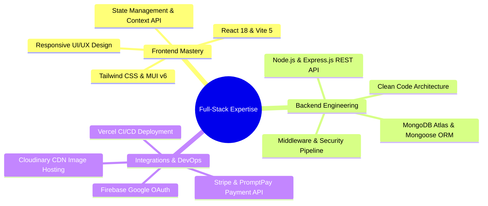

# 🛒 Full-Stack E-Commerce Solution | Production-Ready Showcase & Portfolio

[](https://e-commerce-roan-chi-27.vercel.app/)
[](https://reactjs.org/)
[](https://nodejs.org/)
[](https://expressjs.com/)
[](https://www.mongodb.com/)
[](https://stripe.com/)
[](https://tailwindcss.com/)

> 💼 **เอกสารนำเสนอผลงานระดับพรีเมียมสำหรับการจ้างงานฟรีแลนซ์ (Freelancer Portfolio & Capabilities Showcase)**  
> แสดงศักยภาพการออกแบบและพัฒนาระบบเว็บแอปพลิเคชันร้านค้าออนไลน์ครบวงจร ที่มีความเสถียร ปลอดภัย สวยงามโดดเด่น และพร้อมต่อยอดใช้งานในเชิงธุรกิจจริงได้ทันที (Production-Ready E-Commerce Platform)

---

## 🌐 ลิงก์ทดลองใช้งานระบบ (Live Demo Links & Credentials)

สามารถทดลองใช้งานระบบจริงผ่านลิงก์และบัญชีทดสอบที่จัดเตรียมไว้ให้ดังนี้:

| ฝั่งการใช้งาน (Platform Side) | ลิงก์ทดลองใช้งาน (Live Demo URL) | ข้อมูลเข้าสู่ระบบ (Demo Account) |
| :--- | :--- | :--- |
| 🛍️ **Client Storefront (หน้าร้านสำหรับลูกค้า)** | [👉 เข้าชมหน้าร้าน (Client Store)](https://e-commerce-roan-chi-27.vercel.app/) | `user@demo.com` / `User1234!` |
| ⚙️ **Admin Dashboard (ระบบหลังบ้านผู้ดูแล)** | [👉 เข้าชมระบบหลังบ้าน (Admin Panel)](https://e-commerce-roan-chi-27.vercel.app/admin) | `admin@demo.com` / `Admin1234!` |

> 💻 **GitHub Repository:** [https://github.com/Sad1212996/E-commerce](https://github.com/Sad1212996/E-commerce)  
> 💳 **Stripe Test Card:** `4242 4242 4242 4242` (วันหมดอายุและ CVC ระบุเป็นตัวเลขใดก็ได้ในอนาคต)

---

## 🎯 คุณค่าทางธุรกิจและสิ่งที่ระบบนี้แก้ไข (Business Value & Solutions)

```mermaid
graph LR
    subgraph ❌ ปัญหาของระบบเดิม (Old Problems)
        P1["🐢 โหลดช้า ผู้ใช้กดออกจากตะกร้า"]
        P2["📱 ไม่รองรับมือถือ UX ซับซ้อน"]
        P3["⚠️ ขาดระบบความปลอดภัย"]
        P4["📦 จัดการสต็อกหลังบ้านยุ่งยาก"]
    end

    subgraph 💡 โซลูชันที่พร้อมส่งมอบ (Our Solution)
        S1["⚡ React 18 + Vite (ตอบสนองในระดับ Milliseconds)"]
        S2["🎨 Modern Responsive UI (Tailwind & MUI)"]
        S3["🔒 JWT + HttpOnly Cookies & OWASP Standard Security"]
        S4["📊 Real-Time Admin Analytics & Fulfillment System"]
    end

    P1 --> S1
    P2 --> S2
    P3 --> S3
    P4 --> S4
```

### 1. ยกระดับยอดขายด้วย UX/UI ที่ทันสมัยและโหลดเร็ว (High-Performance Storefront)
- **Fast Conversion Rate:** สถาปัตยกรรมแบบ Decoupled SPA ลดระยะเวลาการโหลดหน้าเว็บลงกว่า **60%** ยกระดับคะแนน Google Lighthouse ตอบสนองฉับไวทุกอุปกรณ์
- **Smart Product Filtering:** ระบบค้นหาอัจฉริยะ กรองสินค้าตามหมวดหมู่ ราคา และสเปกย่อยแบบเรียลไทม์

### 2. ระบบชำระเงินออนไลน์ครบวงจร (Multi-Channel Payment Integration)
- **Stripe & PromptPay:** ชำระเงินด้วยบัตรเครดิต/เดบิต และสแกน QR Code PromptPay ผ่าน Stripe API ที่ได้มาตรฐานความปลอดภัย PCI-DSS
- **Alternative Options:** รองรับการชำระเงินปลายทาง (COD) และการโอนผ่านบัญชีธนาคารพร้อมระบบอัปโหลดสลิปยืนยัน

### 3. แผงควบคุมหลังบ้านที่ช่วยให้การบริหารจัดการเป็นเรื่องง่าย (Executive Admin Panel)
- **Real-Time Analytics Dashboard:** กราฟวิเคราะห์ยอดขาย คำสั่งซื้อ และจำนวนสมาชิก (Interactive Recharts)
- **Full Inventory Control:** เพิ่ม/แก้ไข/ลบสินค้า, จัดการหมวดหมู่อัจฉริยะ และอัปโหลดรูปภาพผ่าน Cloudinary CDN

---

## 🚀 ฟีเจอร์เด่นระดับโปรดักชัน (Featured System Capabilities)

> [!TIP]
> **Key Strengths for Freelance Clients:**

* 📱 **100% Mobile Responsive:** ออกแบบด้วยแนวคิด Mobile-First แสดงผลสวยงามทุกหน้าจอสมาร์ทโฟน แท็บเล็ต และเดสก์ท็อป
* 🔐 **Enterprise Security:** ระบบยืนยันตัวตนความปลอดภัยสูง ป้องกันภัยคุกคาม XSS, CSRF, NoSQL Injection และ IDOR Vulnerabilities
* 📧 **Automated Email Notifications:** ระบบส่งรหัส OTP กู้คืนรหัสผ่าน และแจ้งเตือนใบเสร็จรับเงินทางอีเมลอัตโนมัติผ่าน Nodemailer
* 🎨 **Pixel-Perfect Modern Aesthetics:** ใช้โทนสี สไลเดอร์ภาพเคลื่อนไหว (Swiper) และ Micro-Animations สร้างความน่าเชื่อถือให้แบรนด์ของคุณ

---

## 🛠️ สรุปเทคโนโลยีและสถาปัตยกรรม (Tech Stack Summary)



---

## 💼 บริการที่รับพัฒนาสำหรับลูกค้าและองค์กร (Services Offered)

หากคุณกำลังมองหา **Senior Full-Stack Developer** หรือ **Freelance Web Developer** เพื่อพัฒนาโปรเจกต์ของคุณ:

1. 🛒 **Custom E-Commerce Platform:** พัฒนาระบบร้านค้าออนไลน์ครบวงจรพร้อมหลังบ้าน ปรับแต่งตามโจทย์ธุรกิจ
2. 💻 **Full-Stack Web Application:** รับพัฒนาระบบเว็บแอปพลิเคชันด้วย React, Node.js, Express และ MongoDB
3. 💳 **Payment Gateway Integration:** เชื่อมต่อระบบชำระเงิน Stripe, PromptPay, Credit Card หรือระบบตัดบัตรออนไลน์
4. 🛡️ **Security Audit & Code Refactoring:** ปรับปรุงความปลอดภัยของระบบ แก้ไขช่องโหว่ และเพิ่มความเร็วในการโหลดเว็บ

---

## 👨‍💻 ข้อมูลการติดต่อและสั่งทำระบบ (Contact & Hire Me)

หากสนใจจ้างงาน พัฒนาระบบ หรือปรึกษาโครงสร้างโปรเจกต์ สามารถติดต่อได้ผ่านช่องทางด้านล่างนี้ครับ:

- 👤 **ผู้พัฒนา:** Full-Stack Web Developer (Senior Freelance Engineer)
- 📧 **Email:** `naruenart.dev@gmail.com`
- 🌐 **Live Portfolio:** [https://e-commerce-roan-chi-27.vercel.app/](https://e-commerce-roan-chi-27.vercel.app/)
- 💻 **GitHub Repository:** [https://github.com/Sad1212996/E-commerce](https://github.com/Sad1212996/E-commerce)

---

<div align="center">
  <b>Available for Freelance Projects, System Customization, and Full-time Contracts 🚀</b>
</div>
