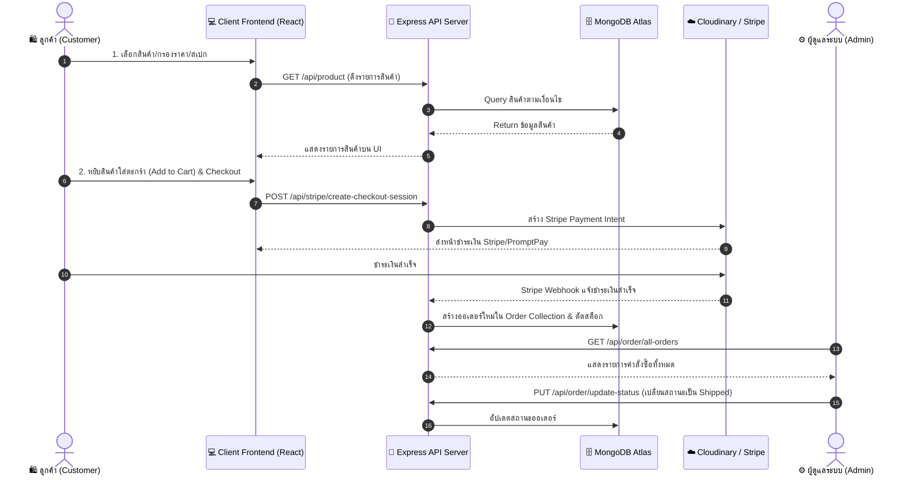
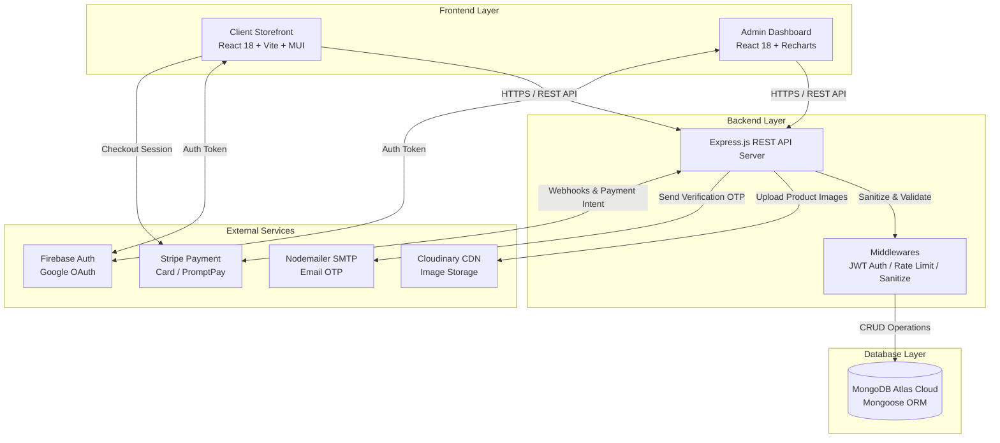

# 🛒 Full-Stack E-Commerce Platform 

[](https://reactjs.org/)
[](https://vitejs.dev/)
[](https://nodejs.org/)
[](https://expressjs.com/)
[](https://www.mongodb.com/)
[](https://tailwindcss.com/)
[](https://stripe.com/)
[](https://firebase.google.com/)

> **คู่มืออธิบายโครงสร้างและกระบวนการทำงานของระบบ E-Commerce (Full-Stack System Workflow)**  
> เอกสารนี้อธิบายการทำงานของระบบร้านค้าออนไลน์แบบครบวงจร ทั้งส่วน **Client Storefront (หน้าร้านสำหรับลูกค้า)**, **Admin Dashboard (ระบบหลังบ้านผู้ดูแล)** และ **RESTful API Server (เซิร์ฟเวอร์ประมวลผล)**

---

## 🌐 ลิงก์ทดลองใช้งานระบบ (Live Demo Links)

| ฝั่งการใช้งาน (Platform Side) | ลิงก์ทดลองใช้งาน (Live Demo Link) | บัญชีทดลองใช้งาน (Demo Account) |
| :--- | :--- | :--- |
| 🛍️ **Client Storefront (หน้าร้านสำหรับลูกค้า)** | [👉 เข้าชมหน้าร้าน (Client Store)](https://e-commerce-roan-chi-27.vercel.app/) | `user@demo.com` / `User1234!` |
| ⚙️ **Admin Dashboard (ระบบหลังบ้านผู้ดูแล)** | [👉 เข้าชมระบบหลังบ้าน (Admin Panel)](https://e-commerce-admin-ashen-ten.vercel.app/) | `admin@demo.com` / `Admin1234!` |

> 💻 **GitHub Repository:** [https://github.com/Sad1212996/E-commerce](https://github.com/Sad1212996/E-commerce)

---

## 📑 สารบัญ (Table of Contents)

1. [อธิบายกระบวนการทำงานของระบบ (System Workflow & Operations)](#-อธิบายกระบวนการทำงานของระบบ-system-workflow--operations)
   - [1.1 ระบบสมัครสมาชิก และการยืนยันตัวตน (Auth & Security Flow)](#11-ระบบสมัครสมาชิก-และการยืนยันตัวตน-auth--security-flow)
   - [1.2 กระบวนการซื้อสินค้าของลูกค้า (Customer Shopping & Checkout Flow)](#12-กระบวนการซื้อสินค้าของลูกค้า-customer-shopping--checkout-flow)
   - [1.3 กระบวนการจัดการหลังบ้านของผู้ดูแลระบบ (Admin Store Management Flow)](#13-กระบวนการจัดการหลังบ้านของผู้ดูแลระบบ-admin-store-management-flow)
   - [1.4 การไหลของข้อมูลระหว่าง Layer (Data Flow Architecture)](#14-การไหลของข้อมูลระหว่าง-layer-data-flow-architecture)
2. [สถาปัตยกรรมระบบ (System Architecture)](#-สถาปัตยกรรมระบบ-system-architecture)
3. [คุณสมบัติหลักของระบบ (Key Features)](#-คุณสมบัติหลักของระบบ-key-features)
4. [โครงสร้างฐานข้อมูล (Database Schema Overview)](#-โครงสร้างฐานข้อมูล-database-schema-overview)
5. [คู่มือการติดตั้งและเปิดใช้งานระบบ (Setup & Installation Guide)](#-คู่มือการติดตั้งและเปิดใช้งานระบบ-setup--installation-guide)

---

## ⚙️ อธิบายกระบวนการทำงานของระบบ (System Workflow & Operations)



---

### 1.1 ระบบสมัครสมาชิก และการยืนยันตัวตน (Auth & Security Flow)
1. **การสมัครสมาชิก & ล็อกอิน (Registration & Login):**
   - ผู้ใช้สมัครสมาชิกด้วย Email/Password หรือเข้าสู่ระบบอย่างรวดเร็วผ่าน **Google Sign-In (Firebase OAuth)**
   - เมื่อล็อกอินสำเร็จ API Server จะสร้าง **JSON Web Token (JWT)** 2 ชุด ได้แก่ `Access Token` และ `Refresh Token` และจัดส่งไปเก็บใน **HttpOnly Secure Cookie** ของเบราว์เซอร์ เพื่อป้องกันการดักจับข้อมูลจากภัยคุกคาม XSS
2. **การกู้คืนรหัสผ่านด้วย OTP (Password Reset via OTP):**
   - หากผู้ใช้ลืมรหัสผ่าน ให้กรอกอีเมล ➔ เซิร์ฟเวอร์สุ่มรหัส OTP ที่ปลอดภัยด้วย `crypto.randomInt` และส่งตรงเข้าอีเมลผ่าน **Nodemailer (SMTP Engine)** ➔ ผู้ใช้ยืนยันรหัส OTP ภายในเวลาที่กำหนด (Expiry Timer) เพื่อตั้งรหัสผ่านใหม่
3. **การควบคุมสิทธิ์ผู้ใช้งาน (Role-Based Authorization):**
   - ระบบจำแนกสิทธิ์ผู้ใช้งานออกเป็น 2 Role ได้แก่ `USER` (สิทธิ์ช้อปปิ้ง) และ `ADMIN` (สิทธิ์เข้าถึงแผงควบคุมหลังบ้าน) ผ่าน Auth Middleware

---

### 1.2 กระบวนการซื้อสินค้าของลูกค้า (Customer Shopping & Checkout Flow)
1. **การค้นหาและกรองสินค้าอัจฉริยะ (Smart Search & Multi-Facet Filtering):**
   - ลูกค้าสามารถค้นหาสินค้าด้วยชื่อคีย์เวิร์ด (Instant Search) หรือกรองสินค้าตาม **หมวดหมู่หลัก (Category)**, **หมวดหมู่ย่อย (Sub-Category)**, **ช่วงราคาสินค้า (Price Range Slider)** และ **สเปกเฉพาะ (RAM, Size, Weight)**
2. **ดูรายละเอียดสินค้า & ซูมภาพ (Product Details & Interactive Zoom):**
   - ในหน้าสินค้า ลูกค้าสามารถดูภาพสินค้าหลายมุมมองพร้อมระบบซูมภาพแบบละเอียด (React Inner Image Zoom), เลือกตัวเลือกสเปก, ตรวจสอบจำนวนสต็อกคงเหลือจริง และอ่านรีวิวสินค้า
3. **ตะกร้าสินค้า & การจัดการที่อยู่ (Cart & Address Management):**
   - เมื่อกดเพิ่มสินค้าลงตะกร้า ข้อมูลจะซิงก์ตรงกับ MongoDB Atlas แบบเรียลไทม์ คำนวณราคารวม ส่วนลด และค่าจัดส่งอัตโนมัติ
   - ลูกค้าสามารถเลือกที่อยู่จัดส่งเดิม หรือเพิ่มที่อยู่ใหม่ผ่านระบบตรวจสอบเบอร์โทรศัพท์ (React International Phone)
4. **การชำระเงินออนไลน์ (Payment Gateway Checkout):**
   - **กรณีชำระเงินด้วย Stripe:** ระบบสร้าง Stripe Checkout Session ➔ ลูกค้าชำระเงินด้วยบัตรเครดิต/เดบิต หรือ สแกน PromptPay ➔ Stripe Webhook แจ้งเตือนเซิร์ฟเวอร์เมื่อชำระเงินสำเร็จ ➔ เซิร์ฟเวอร์เปลี่ยนสถานะออเดอร์เป็น `Paid`
   - **กรณีเก็บเงินปลายทาง (Cash on Delivery - COD):** บันทึกคำสั่งซื้อสถานะ `Pending (เก็บเงินปลายทาง)` ทันที

---

### 1.3 กระบวนการจัดการหลังบ้านของผู้ดูแลระบบ (Admin Store Management Flow)
1. **แดชบอร์ดสรุปสถิติธุรกิจ (Executive Analytics Dashboard):**
   - แสดงกราฟวิเคราะห์ยอดขายรายเดือน, จำนวนออเดอร์ทั้งหมด, สินค้าขายดี 5 อันดับแรก และสถิติผู้ใช้งานใหม่ด้วย **Recharts Analytics**
2. **การจัดการสินค้าและสต็อก (Product CRUD & Stock Management):**
   - Admin สามารถเพิ่มสินค้าใหม่, เขียนรายละเอียดด้วย Rich Text Editor (WYSIWYG), อัปโหลดรูปภาพสินค้าหลายรูปไปยัง **Cloudinary CDN** โดยตรง, กำหนดราคาส่วนลด และอัปเดตจำนวนสต็อกคงเหลือ
3. **การประมวลผลและส่งสินค้า (Order Fulfillment & Tracking):**
   - Admin เข้าดูรายการคำสั่งซื้อทั้งหมด ➔ ตรวจสอบที่อยู่จัดส่งและหลักฐานชำระเงิน ➔ อัปเดตสถานะการจัดส่งเรียลไทม์ (*Pending ➔ Processing ➔ Shipped ➔ Delivered / Cancelled*)
   - สถานะการจัดส่งจะอัปเดตไปแสดงบนหน้าโปรไฟล์และประวัติการสั่งซื้อของผู้ใช้ทันที

---

### 1.4 การไหลของข้อมูลระหว่าง Layer (Data Flow Architecture)

```text
[ React 18 Storefront / Admin UI ]
         │
         ▼  (Axios REST API Requests over HTTPS)
[ Express.js Security Middlewares ]
   ├── Express Rate Limit (ป้องกัน Brute Force)
   ├── NoSQL Input Sanitizer (ป้องกัน NoSQL Injection)
   ├── Helmet.js (Security HTTP Headers)
   └── JWT Cookie Auth Verification (ยืนยันสิทธิ์ Token)
         │
         ▼
[ Express Controllers & Business Logic ]
   ├── Mongoose ORM Model Validation
   ├── Cloudinary API (ฝากรูปภาพสินค้า)
   ├── Stripe API SDK (ประมวลผลบัตรเครดิต & PromptPay)
   └── Nodemailer SMTP Engine (ส่งอีเมล OTP)
         │
         ▼
[ MongoDB Atlas Cloud Database ]
```

---

## 🏗 สถาปัตยกรรมระบบ (System Architecture)



---

## ✨ คุณสมบัติหลักของระบบ (Key Features)

- 🛍️ **หน้าร้านค้าออนไลน์ (Client):** ค้นหาสินค้า, กรองตามราคา/หมวดหมู่/สเปก, ตะกร้าสินค้าเรียลไทม์, Wishlist, ชำระเงินผ่าน Stripe/PromptPay/COD, รองรับ TH/EN
- ⚙️ **ระบบจัดการหลังบ้าน (Admin):** กราฟสรุปยอดขาย (Recharts), เพิ่ม/แก้ไข/ลบ สินค้า (Cloudinary Upload), อัปเดตสถานะจัดส่งออเดอร์, จัดการแบนเนอร์และโลโก้
- 🔒 **ระบบความปลอดภัย (Security):** JWT HttpOnly Cookies, Bcrypt Password Hashing, Rate Limiting, Input Sanitization, OTP Email Verification

---

## 🗄 โครงสร้างฐานข้อมูล (Database Schema Overview)

```text
User Model
├── name (String, Required)
├── email (String, Required, Unique)
├── password (String, Hashed via Bcrypt)
├── role (Enum: 'USER', 'ADMIN')
├── status (Enum: 'Active', 'Inactive', 'Suspended')
├── address_details ([ObjectId -> Address])
└── orderHistory ([ObjectId -> Order])

Product Model
├── name (String), description (String)
├── price (Number), oldPrice (Number), discount (Number)
├── images ([String Cloudinary CDN URLs])
├── category (ObjectId -> Category), subCat
├── countInStock (Number), rating (Number)
└── productRam ([String]), size ([String]), productWeight ([String])

Order Model
├── userId (ObjectId -> User)
├── products ([productId, productTitle, quantity, price, subTotal])
├── totalAmt (Number)
├── paymentMethod (Enum: 'COD', 'Stripe', 'PayPal')
├── payment_status (String), paymentId (String)
├── order_status (String: 'confirm', 'processing', 'shipped', 'delivered', 'cancelled')
└── delivery_address (ObjectId -> Address)
```

---

<div align="center">
  <b>Comprehensive E-Commerce Architecture & Workflow Documentation 🚀</b>
</div>
