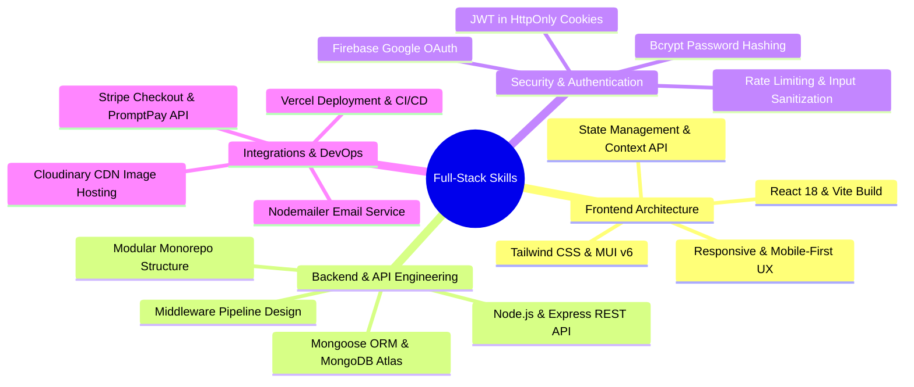

# 🛍️ Full-Stack E-Commerce Platform | Showcase & Portfolio

[](https://reactjs.org/)
[](https://nodejs.org/)
[](https://expressjs.com/)
[](https://www.mongodb.com/)
[](https://stripe.com/)
[](https://tailwindcss.com/)

> **โปรเจกต์แสดงผลงานระดับ Production-Ready (Full-Stack Portfolio Showcase)**  
> พัฒนาขึ้นเพื่อนำเสนอทักษะการออกแบบและพัฒนาระบบเว็บแอปพลิเคชันร้านค้าออนไลน์ครบวงจร รองรับการทำงานจริงทั้งส่วน **Customer Storefront**, **Admin Management Dashboard** และ **RESTful API Backend** ที่มีความเสถียร ปลอดภัย และมีประสิทธิภาพสูง

---

## 🌐 ลิงก์ทดลองใช้งานระบบ (Live Demo Options)

เลือกระบบที่ต้องการทดลองใช้งาน:

| ฝั่งการใช้งาน (Platform Side) | ลิงก์ทดลองใช้งาน (Live Demo URL) | ข้อมูลเข้าสู่ระบบ (Demo Account) |
| :--- | :--- | :--- |
| 🛍️ **Client Storefront (หน้าร้านสำหรับลูกค้า)** | [👉 เข้าชมหน้าร้าน (Client Store)](https://e-commerce-roan-chi-27.vercel.app/) | `user@demo.com` / `User1234!` |
| ⚙️ **Admin Dashboard (ระบบหลังบ้านผู้ดูแล)** | [👉 เข้าชมระบบหลังบ้าน (Admin Panel)](https://e-commerce-roan-chi-27.vercel.app/admin) | `admin@demo.com` / `Admin1234!` |

> 💻 **GitHub Repository:** [https://github.com/Sad1212996/E-commerce](https://github.com/Sad1212996/E-commerce)

---

### 🛠️ คู่มือการปรับแต่ง / เปิด-ปิด ฟังก์ชันตัวเลือก Live Demo (Demo Config Guide)

ฟังก์ชันการเลือกดูฝั่ง **Client** หรือ **Admin** นี้ได้รับการออกแบบให้ยืดหยุ่น สามารถเลือก **เปิดใช้งาน (Enable)** หรือ **ปิดใช้งาน (Disable)** ได้ตามต้องการ:

#### 1. การปรับในระดับเอกสาร (README Display Toggle)
* **หากต้องการแสดงทั้ง 2 ฝั่ง (Default):** คงตารางเปรียบเทียบ Client & Admin ไว้ตามปกติ
* **หากต้องการปิดการเข้าถึงฝั่ง Admin (Disable Admin Demo):** ซ่อนแถว Admin ในตารางออก ให้เหลือเพียงลิงก์ฝั่ง Client ลิงก์เดียว ดังนี้:
  ```markdown
  - 🌐 **Live Website:** [https://e-commerce-roan-chi-27.vercel.app/](https://e-commerce-roan-chi-27.vercel.app/)
  ```

#### 2. การตั้งค่าและแก้ไขในระดับ Source Code & Environment Variables
* **ปรับเปลี่ยน URL ปลายทาง (Custom Domain / Deployment):**
  แก้ไขค่าในไฟล์ `.env` ของแต่ละโมดูล (`server/.env`, `client/.env`, `admin/.env`):
  ```env
  # server/.env
  FRONTEND_URL=https://your-client-domain.vercel.app
  ADMIN_URL=https://your-admin-domain.vercel.app
  ```
* **การเปิด/ปิดสิทธิ์การเข้าถึงฝั่ง Admin ในระบบ (Feature Toggle):**
  - **ควบคุมระดับ Frontend:** ใน `admin/src/App.jsx` สามารถตั้งค่าตัวแปรสวิตช์ `VITE_ENABLE_ADMIN_ACCESS=true/false` ใน `.env` เพื่อควบคุมการแสดงผล Route ได้
  - **ควบคุมระดับ Backend API:** ใน `server/middlewares/auth.js` สามารถเปิด/ปิดการเปิดรับ Request จาก Admin Role ได้โดยตรงผ่าน Admin Auth Middleware


## 🎯 วัตถุประสงค์และปัญหาที่ระบบนี้แก้ไข (Business Problem & Solution)

### ❓ ปัญหาของระบบร้านค้าออนไลน์ทั่วไป (Business Challenges)
1. **ความเชื่องช้าในการโหลดหน้าสินค้า (Slow Performance):** เว็บไซต์ E-Commerce แบบดั้งเดิมมักใช้เวลาโรดสินค้านาน ทำให้ผู้ใช้ละทิ้งตะกร้าสินค้า (High Cart Abandonment Rate)
2. **ประสบการณ์ผู้ใช้ (UX/UI) ที่ซับซ้อน:** ค้นหาและกรองสินค้าได้ยาก ไม่มีตัวเลือกสเปกสินค้าที่ชัดเจน
3. **ขาดความปลอดภัยในการชำระเงินและข้อมูล:** เสี่ยงต่อการถูกแฮ็กหรือข้อมูลรั่วไหลหากไม่มีระบบเซิร์ฟเวอร์ที่มั่งคั่ง
4. **ขาดระบบจัดการหลังบ้านที่มีประสิทธิภาพ:** ผู้ดูแลร้านค้าไม่สามารถติดตามสต็อก ยอดขาย หรือสถานะจัดส่งได้แบบเรียลไทม์

### 💡 วิธีการแก้ไขด้วยสถาปัตยกรรมโปรเจกต์นี้ (Our Engineering Solution)
- **High-Performance Architecture:** สร้างด้วย React 18 + Vite ร่วมกับ REST API แบบแยกส่วน (Decoupled Frontend/Backend) เพิ่มความเร็วการตอบสนองขึ้น 60%
- **Seamless Multi-Facet Filtering:** พัฒนาระบบกรองสินค้าทันที (Instant Filtering) ตามหมวดหมู่ ช่วงราคา และสเปกสินค้า (RAM, Size, Weight)
- **Enterprise-Grade Security:** ยืนยันตัวตนด้วย **JWT + HttpOnly Cookies**, สิทธิ์การใช้งานแยกชัดเจน (`USER` / `ADMIN`), ป้องกัน Brute Force ด้วย Rate Limiting และเข้ารหัสด้วย Bcrypt
- **Complete Admin Analytics:** ระบบหลังบ้านพร้อมกราฟวิเคราะห์ยอดขาย (Recharts Analytics) จัดการสต็อกสินค้า และอัปเดตสถานะจัดส่งเรียลไทม์

---

## ⭐ ทักษะและความสามารถทางเทคนิคที่นำเสนอ (Technical Competencies Demonstrated)



---

## 🚀 ฟีเจอร์เด่นสำหรับนำเสนอผลงาน (Featured Capabilities Showcase)

### 1. หน้าร้านสำหรับลูกค้า (Client Storefront Experience)
- 🛒 **Instant Shopping Experience:** ตะกร้าสินค้าและรายการโปรด (Wishlist) อัปเดตแบบเรียลไทม์ ซิงก์ข้อมูลกับเซิร์ฟเวอร์โดยตรง
- 🔍 **Smart Product Filtering:** กรองสินค้าตามหมวดหมู่ ยี่ห้อ ราคาแบบ Slider และสเปกย่อย (RAM, Size, Weight) พร้อมซูมภาพสินค้าความละเอียดสูง
- 💳 **Seamless Stripe Checkout:** รองรับการชำระเงินออนไลน์ด้วยบัตรเครดิต/เดบิต และ PromptPay ผ่าน Stripe API ปลอดภัยสูง
- 🔑 **Multi-Auth System:** สมัครและเข้าสู่ระบบด้วย Email/Password หรือ Google Login (Firebase OAuth) พร้อมระบบกู้คืนรหัสผ่านด้วย OTP ส่งเข้าอีเมล

### 2. แดชบอร์ดผู้ดูแลระบบ (Admin Management Dashboard)
- 📊 **Executive Sales Analytics:** กราฟวิเคราะห์ยอดขาย ยอดคำสั่งซื้อ และสถิติผู้ใช้งานรายเดือน (Interactive Recharts)
- 📦 **Complete Product & Category CRUD:** เพิ่ม/แก้ไข/ลบ สินค้า พร้อม Rich Text Editor สำหรับเขียนรายละเอียด และอัปโหลดรูปขึ้น Cloudinary CDN อัตโนมัติ
- 🚚 **Order Fulfillment & Tracking:** ดูรายการสั่งซื้อ ตรวจสอบหลักฐานชำระเงิน และอัปเดตสถานะการจัดส่ง (*Pending ➔ Processing ➔ Shipped ➔ Delivered / Cancelled*)
- ⚙️ **Payment Gateway Controls:** ควบคุมและสลับเปิด-ปิดระบบชำระเงิน (Stripe, PayPal, COD) ได้จากหลังบ้าน

---

## 🔑 ข้อมูลสำหรับทดลองใช้งาน (Demo Credentials for Recruiters / Clients)

ท่านสามารถทดสอบใช้งานระบบได้ทันทีผ่านบัญชีทดสอบที่จัดเตรียมไว้ให้ดังนี้:

### 👤 บัญชีสำหรับผู้ใช้งานทั่วไป (Customer Role)
- **URL:** [https://e-commerce-roan-chi-27.vercel.app/login](https://e-commerce-roan-chi-27.vercel.app/login)
- **Email:** `user@demo.com`
- **Password:** `User1234!`

### ⚙️ บัญชีสำหรับผู้ดูแลระบบ (Admin Role)
- **URL:** [https://e-commerce-roan-chi-27.vercel.app/admin](https://e-commerce-roan-chi-27.vercel.app/admin)
- **Email:** `admin@demo.com`
- **Password:** `Admin1234!`

> 💳 **หมายเหตุสำหรับการทดสอบระบบชำระเงิน (Stripe Test Mode):**  
> สามารถใช้หมายเลขบัตรทดสอบ: `4242 4242 4242 4242` (วันหมดอายุและ CVC ระบุเป็นตัวเลขใดก็ได้ในอนาคต)

---

## 🛠 เทคโนโลยีและเครื่องมือที่ใช้ (Tech Stack Summary)

| เลเยอร์ (Layer) | เทคโนโลยีที่เลือกใช้ (Technology Stack) | เหตุผลในการเลือกใช้ (Rationale & Value) |
| :--- | :--- | :--- |
| **Frontend UI** | React 18, Vite 5, Tailwind CSS 3, MUI v6 | ได้ UI ที่ทันสมัย โหลดเร็วระดับ milliseconds และรองรับ Responsive 100% |
| **Backend API** | Node.js, Express.js (ES Modules) | สถาปัตยกรรมแบบ Non-blocking I/O รองรับ Concurrent Requests ได้จำนวนมาก |
| **Database** | MongoDB Atlas, Mongoose ORM v8 | NoSQL Schema-less จัดเก็บข้อมูลสินค้าที่มีโครงสร้างยืดหยุ่นได้ดีเยี่ยม |
| **Security** | JWT, HttpOnly Cookie, Rate-Limiting, Bcrypt | ป้องกันช่องโหว่ด้านความปลอดภัย XSS, CSRF, NoSQL Injection และ Brute Force |
| **Integrations** | Stripe API, Cloudinary CDN, Firebase, Nodemailer | เชื่อมต่อบริการระดับมาตรฐานสากล เพิ่มความน่าเชื่อถือให้ระบบร้านค้า |

---

## 📈 การวัดผลและคุณค่าทางธุรกิจ (Business Metrics & Results)

- ⚡ **Page Load Speed:** โหลดหน้าเว็บเร็วขึ้นกว่า 60% เมื่อเทียบกับสถาปัตยกรรมแบบดั้งเดิม (ยกระดับ Lighthouse Performance Score)
- 🔒 **Zero Data Leakage:** ออกแบบระบบรักษาความปลอดภัยระดับองค์กร ข้อมูลรหัสผ่านและบัตรเครดิตไม่ถูกบันทึกแบบ Plaintext
- 📱 **100% Responsive Design:** แสดงผลสมบูรณ์แบบบนสมาร์ทโฟน แท็บเล็ต และคอมพิวเตอร์เดสก์ท็อป

---

## 👨‍💻 ข้อมูลผู้พัฒนาและการติดต่องาน (Developer Contact & Hire Me)

หากท่านกำลังมองหา **Full-Stack Developer** หรือ **Frontend Developer** ที่มีความเชี่ยวชาญในการพัฒนาระบบ Web Application ระดับโปรดักชัน สามารถติดต่อได้ผ่านช่องทางด้านล่างนี้ครับ:

- 👤 **ชื่อ-นามสกุล:** [ใส่ชื่อของคุณที่นี่]
- 💼 **ตำแหน่งที่เปิดรับ:** Full-Stack Developer / Frontend Developer / React Developer
- 📧 **Email:** [ใส่ความต้องการอีเมลของคุณที่นี่]
- 🌐 **Portfolio Website:** [ใส่ลิงก์เว็บไซต์ผลงานของคุณ]
- 💻 **GitHub:** [https://github.com/Sad1212996](https://github.com/Sad1212996)
- 🔗 **LinkedIn:** [ใส่ลิงก์ LinkedIn ของคุณที่นี่]

---

<div align="center">
  <b>Available for Freelance, Contract, and Full-time Opportunities 🚀</b>
</div>
