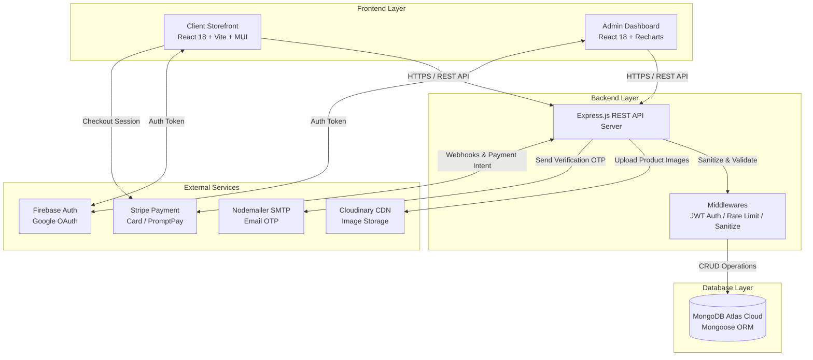

# 🛒 Full-Stack E-Commerce Platform 

[](https://reactjs.org/)
[](https://vitejs.dev/)
[](https://nodejs.org/)
[](https://expressjs.com/)
[](https://www.mongodb.com/)
[](https://tailwindcss.com/)
[](https://stripe.com/)
[](https://firebase.google.com/)
[](https://opensource.org/licenses/ISC)

> **เว็บแอปพลิเคชันระบบร้านค้าออนไลน์อีคอมเมิร์ซแบบครบวงจร (Full-Stack Web Application)**  
> ประกอบด้วย **Client Storefront (หน้าร้านสำหรับลูกค้า)**, **Admin Dashboard (ระบบหลังบ้านผู้ดูแล)** และ **RESTful API Server (เซิร์ฟเวอร์ประมวลผล)** รองรับการทำงานแบบเรียลไทม์ ชำระเงินผ่าน Stripe/PromptPay ปลอดภัยด้วย JWT & HttpOnly Cookies และ Firebase OAuth

---

## 🌐 Live Demo & GitHub Repository

- 🔗 **Live Demo (Vercel):** [https://e-commerce-roan-chi-27.vercel.app/](https://e-commerce-roan-chi-27.vercel.app/)
- 💻 **GitHub Repository:** [https://github.com/Sad1212996/E-commerce](https://github.com/Sad1212996/E-commerce)

---

## 📑 สารบัญ (Table of Contents)

1. [ภาพรวมของโปรเจกต์ (Project Overview)](#-ภาพรวมของโปรเจกต์-project-overview)
2. [สถาปัตยกรรมระบบ (System Architecture)](#-สถาปัตยกรรมระบบ-system-architecture)
3. [คุณสมบัติหลักของระบบ (Key Features)](#-คุณสมบัติหลักของระบบ-key-features)
   - [หน้าร้านสำหรับลูกค้า (Client Storefront)](#1-หน้าร้านสำหรับลูกค้า-client-storefront)
   - [ระบบจัดการหลังบ้าน (Admin Dashboard)](#2-ระบบจัดการหลังบ้าน-admin-dashboard)
   - [เซิร์ฟเวอร์ & ความปลอดภัย (Server & Security Features)](#3-เซิร์ฟเวอร์--ความปลอดภัย-server--security-features)
4. [เทคโนโลยีที่ใช้ (Tech Stack)](#-เทคโนโลยีที่ใช้-tech-stack)
5. [โครงสร้างโฟลเดอร์ (Directory Structure)](#-โครงสร้างโฟลเดอร์-directory-structure)
6. [การติดตั้งและเริ่มต้นใช้งาน (Installation & Setup)](#-การติดตั้งและเริ่มต้นใช้งาน-installation--setup)
7. [การตั้งค่า Environment Variables (.env)](#-การตั้งค่า-environment-variables-env)
8. [คู่มือ API Endpoints (API Specification)](#-คู่มือ-api-endpoints-api-specification)
9. [โครงสร้างฐานข้อมูล (Database Schema)](#-โครงสร้างฐานข้อมูล-database-schema)
10. [คู่มือการ Deploy สู่ Production และประมาณการค่าใช้จ่าย (Deployment & Costs)](#-คู่มือการ-deploy-สู่-production-และประมาณการค่าใช้จ่าย-deployment--costs)

---

## 📌 ภาพรวมของโปรเจกต์ (Project Overview)

โปรเจกต์นี้ได้รับการออกแบบและพัฒนาเป็น **Modern Full-Stack E-Commerce Platform** เพื่อตอบโจทย์ธุรกิจร้านค้าออนไลน์ในยุคปัจจุบัน รองรับสินค้าหลากหลายประเภท (สินค้าไอที, แฟชั่น, ดอกไม้, ของขวัญ ฯลฯ) พร้อมระบบการคัดกรองสินค้าขั้นสูง การจัดการคำสั่งซื้อแบบเรียลไทม์ และระบบรักษาความปลอดภัยระดับองค์กร

### จุดเด่นของโปรเจกต์ (Highlights)
- **Modular Monorepo Structure:** แยกส่วนงานชัดเจน 3 ส่วน (`client`, `admin`, `server`) ทำให้บำรุงรักษาและต่อเติมระบบได้ง่าย
- **High Performance UI:** พัฒนาด้วย React 18 + Vite เพื่อการโหลดที่รวดเร็ว พร้อม Tailwind CSS & Material UI (MUI v6) สำหรับดีไซน์ที่สวยงาม ทันสมัย รองรับทุกขนาดหน้าจอ (Responsive Design)
- **Multi-Payment Gateway:** รองรับการชำระเงินผ่านบัตรเครดิต/เดบิต, PromptPay (Stripe API) และการเก็บเงินปลายทาง (Cash on Delivery)
- **Enterprise-Grade Security:** ระบบยืนยันตัวตนด้วย JWT + HttpOnly Cookies, Firebase Google OAuth, Password Hashing ด้วย Bcrypt, OTP Verification via Email, Rate Limiting และ NoSQL Input Sanitization

---

## 🏗 สถาปัตยกรรมระบบ (System Architecture)



---

## ✨ คุณสมบัติหลักของระบบ (Key Features)

### 1. หน้าร้านสำหรับลูกค้า (Client Storefront)
* **หน้าแรกและสื่อโฆษณา (Homepage & Banners):**
  * สไลด์เดอร์หน้าแรกแบบไดนามิก (Home Slider Carousel)
  * แบนเนอร์โปรโมชันหลายรูปแบบ (Banner V1, Banner List 2)
  * แสดงสินค้ายอดนิยม (Featured Products), สินค้าขายดี (Best Sellers), สินค้าลดราคา (Discount Sales)
* **การค้นหาและกรองสินค้า (Search & Advanced Filtering):**
  * ค้นหาสินค้าด้วยชื่อคีย์เวิร์ด (Instant Search)
  * กรองสินค้าตามหมวดหมู่ (Category / Sub-category)
  * ช่วงราคาสินค้าด้วย Price Range Slider
  * กรองตามสเปกสินค้า (RAM, Size, Weight)
  * จัดเรียงสินค้าตาม ราคาต่ำ-สูง, ราคาสูง-ต่ำ, หรือสินค้ามาใหม่
* **รายละเอียดสินค้า (Product Detail Page):**
  * รูปภาพสินค้าหลายมุมมอง พร้อมระบบซูมภาพแบบละเอียด (React Inner Image Zoom & Swiper)
  * เลือกตัวเลือกสินค้า (Variants: Size, RAM, Weight)
  * ตรวจสอบจำนวนสต็อกสินค้าคงเหลือจริง
  * ระบบให้คะแนนและรีวิวสินค้า (Ratings & Reviews)
  * สไลเดอร์สินค้าที่เกี่ยวข้อง (Related Products)
* **ตะกร้าสินค้าและการสั่งซื้อ (Cart & Checkout System):**
  * ตะกร้าสินค้าเรียลไทม์ (Real-time Shopping Cart Sync)
  * คำนวณราคารวม ค่าจัดส่ง และส่วนลดอัตโนมัติ
  * ระบบจัดการที่อยู่จัดส่ง (Address Book Management - เพิ่ม/แก้ไข/ลบที่อยู่)
  * ชำระเงินออนไลน์ด้วย Stripe (บัตรเครดิต/เดบิต & PromptPay) หรือ เก็บเงินปลายทาง (COD)
* **บัญชีผู้ใช้และประวัติการสั่งซื้อ (User Account & Order History):**
  * ระบบสมัครสมาชิก / เข้าสู่ระบบด้วย Email-Password หรือ Google OAuth (Firebase)
  * ระบบลืมรหัสผ่านด้วยรหัส OTP ส่งตรงเข้าอีเมล (Nodemailer)
  * ติดตามสถานะคำสั่งซื้อ (Order Status Tracking: Pending, Processing, Shipped, Delivered, Cancelled)
  * รายการสินค้าที่ชอบ / โปรด (Wishlist / MyList Management)
  * สลับเปลี่ยนภาษา TH / EN

---

### 2. ระบบจัดการหลังบ้าน (Admin Dashboard)
* **แดชบอร์ดสรุปสถิติ (Analytics Dashboard):**
  * กราฟสรุปยอดขายรวมรายเดือน และยอดคำสั่งซื้อ (Recharts Analytics)
  * สรุปจำนวนสินค้า, จำนวนผู้ใช้งาน, และคำสั่งซื้อที่รอการประมวลผล
* **จัดการสินค้าและหมวดหมู่ (Product & Category Management):**
  * ระบบเพิ่ม/แก้ไข/ลบ สินค้า (Product CRUD) พร้อมตัวเลือกสเปก (RAM, Size, Weight, Discount, Stock)
  * ตัวแก้ไขข้อความรายละเอียดสินค้าแบบ Rich Text Editor (React Simple WYSIWYG)
  * อัปโหลดรูปภาพสินค้าหลายรูปไปยัง Cloudinary CDN Direct Storage
  * จัดการหมวดหมู่หลัก (Main Category), หมวดหมู่ย่อย (Sub Category), และหมวดหมู่ระดับสาม
* **จัดการคำสั่งซื้อ (Order Management System):**
  * ตรวจสอบรายการคำสั่งซื้อทั้งหมดของร้านค้า
  * เปลี่ยนสถานะการจัดส่งสินค้า (Pending ➔ Processing ➔ Shipped ➔ Delivered / Cancelled)
  * ดูรายละเอียดผู้ซื้อ, ที่อยู่จัดส่ง, สลิปโอนเงิน หรือสถานะ Stripe Payment
* **จัดการเนื้อหาเว็บไซต์ (CMS Content Management):**
  * จัดการสไลด์หน้าแรก (Home Slides) และ แบนเนอร์โปรโมชัน (Banners)
  * จัดการโลโก้เว็บไซต์ (Website Logo) และ บทความบล็อก (Blog Management)
* **ตั้งค่าระบบชำระเงิน (Payment Gateway Settings):**
  * เปิด/ปิด ช่องทางการชำระเงิน (Stripe, PayPal, Cash on Delivery)
  * จัดการ API Keys และการเชื่อมต่อ Payment Gateway ผ่านแผงควบคุม

---

### 3. เซิร์ฟเวอร์ & ความปลอดภัย (Server & Security Features)
* **การยืนยันตัวตนระดับสูง (Advanced Authentication):**
  * JSON Web Token (JWT) พร้อมการจัดเก็บใน HttpOnly, Secure Cookie เพื่อป้องกัน XSS Attack
  * ระบบแยกสิทธิ์ผู้ใช้งาน (Role-Based Access Control: `ADMIN` vs `USER`)
* **ความปลอดภัยของข้อมูล (Data Protection & Security):**
  * Password Hashing ด้วย `bcryptjs` (มีระบบป้องกัน Double-Encryption ปลอดภัย 100%)
  * การสุ่มรหัส OTP ที่ปลอดภัยด้วย `crypto.randomInt`
  * Rate Limiting (ป้องกัน Brute Force Attack บน API เส้นสำคัญ เช่น Login, Register, Forgot Password)
  * Input Sanitization Middleware ป้องกัน NoSQL Injection และ XSS Attack
  * Helmet.js ตั้งค่า HTTP Security Headers
  * CORS origin validation ป้องกัน Unauthorized API requests

---

## 🛠 เทคโนโลยีที่ใช้ (Tech Stack)

### Frontend (Client & Admin)
| หมวดหมู่ | เทคโนโลยี |
| :--- | :--- |
| **Framework / Library** | React 18, Vite 5/6, React Router DOM v7 |
| **UI & Styling** | Tailwind CSS v3, Material UI (MUI v6), Styled Components |
| **State & HTTP Client** | Axios, React Context API |
| **Components & Icons** | React Icons, Swiper Slider, React Hot Toast, Recharts, React Inner Image Zoom |
| **Auth & Payment UI** | Firebase Auth (Google OAuth), Stripe Elements JS |

### Backend (Server) & Database
| หมวดหมู่ | เทคโนโลยี |
| :--- | :--- |
| **Runtime & Framework** | Node.js (ES Modules), Express.js v4 |
| **Database & ORM** | MongoDB Cloud (Atlas), Mongoose ORM v8 |
| **Security & Auth** | JWT (JsonWebToken), Bcryptjs, Cookie-Parser, Helmet, Express-Rate-Limit |
| **File Upload & Cloud** | Multer, Cloudinary API v2 |
| **Payments & Gateway** | Stripe Node.js SDK v22, PayPal Checkout SDK |
| **Email Service** | Nodemailer (SMTP Engine) |

---

## 📁 โครงสร้างโฟลเดอร์ (Directory Structure)

```text
E-commerce/
├── client/                     # 🛍️ Frontend Storefront (React 18 + Vite)
│   ├── public/                 # Static Assets
│   ├── src/
│   │   ├── assets/             # Images & Vector Graphics
│   │   ├── components/         # Reusable UI Components (Header, Footer, ProductCard, etc.)
│   │   ├── context/            # Global React Context State (Auth, Cart, Wishlist)
│   │   ├── Pages/              # Page Views (Home, ProductDetail, Cart, Checkout, Profile)
│   │   ├── utils/              # Helper functions & Axios API Configuration
│   │   ├── App.jsx             # Main Router Setup
│   │   └── main.jsx            # Entry point
│   ├── package.json
│   └── vite.config.js
│
├── admin/                      # ⚙️ Admin Management Dashboard (React 18 + Vite)
│   ├── public/                 # Admin Static Assets
│   ├── src/
│   │   ├── components/         # Admin Components (Sidebar, Header, Analytics Cards)
│   │   ├── Pages/              # Admin Views (Dashboard, Products, Orders, Categories, Banners)
│   │   ├── utils/              # Admin API Service Wrappers
│   │   └── App.jsx             # Admin Routes & Auth Protection
│   ├── package.json
│   └── vite.config.js
│
├── server/                     # 🚀 RESTful API Backend Server (Node.js + Express)
│   ├── config/                 # DB Connection (connectDb.js)
│   ├── controllers/            # Route Logic Handlers (User, Product, Order, Cart, Stripe)
│   ├── middlewares/            # Auth, Admin Verification, Rate Limiting, Input Sanitizer
│   ├── models/                 # Mongoose Data Schemas (User, Product, Order, Category, etc.)
│   ├── route/                  # API Endpoint Express Routers
│   ├── utils/                  # Cloudinary Storage Config, Nodemailer Email Sender
│   ├── index.js                # Server Entry Point & Global Middlewares
│   └── package.json
│
└── PRODUCTION_DEPLOYMENT_GUIDE.txt  # 📖 คู่มือการ Deploy สู่ Production & ค่าใช้จ่าย
```

---

## 🚀 การติดตั้งและเริ่มต้นใช้งาน (Installation & Setup)

### 1. ความต้องการของระบบ (Prerequisites)
- **Node.js** v18.0.0 ขึ้นไป
- **npm** v9.0.0 ขึ้นไป หรือ **yarn** / **pnpm**
- **MongoDB Atlas** Account & Connection String
- **Cloudinary** Account (สำหรับฝากรูปภาพ)
- **Stripe** Account (สำหรับระบบชำระเงิน API Keys)

---

### 2. ขั้นตอนการติดตั้ง (Step-by-Step Setup)

#### Step 1: Clone Repository
```bash
git clone https://github.com/Sad1212996/E-commerce.git
cd E-commerce
```

#### Step 2: ติดตั้ง Dependencies และตั้งค่า Backend Server
```bash
cd server
npm install

# สร้างไฟล์ .env สำหรับเซิร์ฟเวอร์ (อ้างอิงจากรายละเอียดด้านล่าง)
# รันเซิร์ฟเวอร์ในโหมด Development
npm run dev
```
*(เซิร์ฟเวอร์จะเริ่มทำงานที่ `http://localhost:5000`)*

#### Step 3: ติดตั้ง Dependencies และรัน Client Storefront
```bash
# เปิด Terminal ใหม่
cd client
npm install

# สร้างไฟล์ .env สำหรับ client
npm run dev
```
*(Client จะเริ่มทำงานที่ `http://localhost:5173`)*

#### Step 4: ติดตั้ง Dependencies และรัน Admin Dashboard
```bash
# เปิด Terminal ใหม่
cd admin
npm install

# สร้างไฟล์ .env สำหรับ admin
npm run dev
```
*(Admin จะเริ่มทำงานที่ `http://localhost:5174`)*

---

## 🔑 การตั้งค่า Environment Variables (.env)

### 1. Server Environment Variables (`/server/.env`)
```env
PORT=5000
MONGODB_URI=mongodb+srv://<username>:<password>@cluster0.xxx.mongodb.net/ecommerce_db?retryWrites=true&w=majority

# JWT Secrets
JSONWEBTOKEN_SECRET_KEY=your_jwt_access_secret_key_here
SECRET_KEY_REFRESH_TOKEN=your_jwt_refresh_secret_key_here

# Frontend & Admin Domain URLs (for CORS & Cookies)
FRONTEND_URL=http://localhost:5173
ADMIN_URL=http://localhost:5174

# Cloudinary Storage Configuration
CLOUDINARY_CLOUD_NAME=your_cloudinary_cloud_name
CLOUDINARY_API_KEY=your_cloudinary_api_key
CLOUDINARY_API_SECRET=your_cloudinary_api_secret

# Stripe Payment Gateway
STRIPE_SECRET_KEY=sk_test_51XXXXXXXXXXXXXX
STRIPE_WEBHOOK_SECRET=whsec_XXXXXXXXXXXXXX

# Nodemailer Email Configuration
EMAIL_USER=your_email@gmail.com
EMAIL_PASS=your_app_password
```

### 2. Client Environment Variables (`/client/.env`)
```env
VITE_API_URL=http://localhost:5000
VITE_STRIPE_PUBLIC_KEY=pk_test_51XXXXXXXXXXXXXX

# Firebase Config (Optional for Google Login)
VITE_FIREBASE_API_KEY=your_firebase_api_key
VITE_FIREBASE_AUTH_DOMAIN=your_project.firebaseapp.com
VITE_FIREBASE_PROJECT_ID=your_project_id
```

### 3. Admin Environment Variables (`/admin/.env`)
```env
VITE_API_URL=http://localhost:5000
```

---

## 📡 คู่มือ API Endpoints (API Specification)

### 👤 Authentication & User Routes (`/api/user`)
| Method | Endpoint | Description | Access |
| :--- | :--- | :--- | :--- |
| `POST` | `/api/user/register` | สมัครสมาชิกใหม่ | Public |
| `POST` | `/api/user/login` | เข้าสู่ระบบ (รับ JWT Cookie) | Public |
| `GET` | `/api/user/logout` | ออกจากระบบ (ล้าง Cookie) | User / Admin |
| `POST` | `/api/user/forgot-password` | ขอรหัส OTP สำหรับรีเซ็ตรหัสผ่าน | Public |
| `POST` | `/api/user/verify-forgot-password-otp` | ยืนยันรหัส OTP | Public |
| `PUT` | `/api/user/reset-password` | ตั้งรหัสผ่านใหม่ | Public |
| `GET` | `/api/user/user-details` | ดึงข้อมูลโปรไฟล์ผู้ใช้ปัจจุบัน | User / Admin |
| `GET` | `/api/user/get-all-users` | ดึงข้อมูลผู้ใช้งานทั้งหมด | Admin Only |

### 📦 Product Routes (`/api/product`)
| Method | Endpoint | Description | Access |
| :--- | :--- | :--- | :--- |
| `GET` | `/api/product` | ดึงรายการสินค้าทั้งหมด (พร้อม Filter, Pagination) | Public |
| `GET` | `/api/product/:id` | ดึงข้อมูลรายละเอียดสินค้าตาม ID | Public |
| `POST` | `/api/product/create` | เพิ่มสินค้าใหม่ (รองรับ Upload รูปภาพ) | Admin Only |
| `PUT` | `/api/product/:id` | แก้ไขข้อมูลสินค้า | Admin Only |
| `DELETE`| `/api/product/:id` | ลบสินค้าออกจากระบบ | Admin Only |

### 🛒 Cart & Wishlist Routes (`/api/cart` & `/api/myList`)
| Method | Endpoint | Description | Access |
| :--- | :--- | :--- | :--- |
| `GET` | `/api/cart` | ดึงรายการสินค้าในตะกร้า | User |
| `POST` | `/api/cart/add` | เพิ่มสินค้าลงในตะกร้า | User |
| `PUT` | `/api/cart/update-qty` | อัปเดตจำนวนสินค้าในตะกร้า | User |
| `DELETE`| `/api/cart/delete-item` | ลบสินค้าออกจากตะกร้า | User |
| `GET` | `/api/myList` | ดึงรายการสินค้าโปรด (Wishlist) | User |
| `POST` | `/api/myList/add` | เพิ่ม/ลบ สินค้าในรายการโปรด | User |

### 💳 Order & Payment Routes (`/api/order` & `/api/stripe`)
| Method | Endpoint | Description | Access |
| :--- | :--- | :--- | :--- |
| `POST` | `/api/order/create` | สร้างคำสั่งซื้อใหม่ | User |
| `GET` | `/api/order/user-orders` | ดึงประวัติคำสั่งซื้อของผู้ใช้ | User |
| `GET` | `/api/order/all-orders` | ดึงคำสั่งซื้อทั้งหมดในร้านค้า | Admin Only |
| `PUT` | `/api/order/update-status` | อัปเดตสถานะจัดส่งออเดอร์ | Admin Only |
| `POST` | `/api/stripe/create-checkout-session` | สร้าง Stripe Checkout Session | User |

---

## 🗄 โครงสร้างฐานข้อมูล (Database Schema)

```text
User Model
├── name (String, Required)
├── email (String, Required, Unique)
├── password (String, Hashed)
├── role (Enum: 'USER', 'ADMIN')
├── status (Enum: 'Active', 'Inactive', 'Suspended')
├── address_details ([ObjectId -> Address])
└── orderHistory ([ObjectId -> Order])

Product Model
├── name (String, Required)
├── description (String, Required)
├── price (Number), oldPrice (Number), discount (Number)
├── images ([String Cloudinary URLs])
├── category (ObjectId -> Category), catName, subCat
├── countInStock (Number)
├── productRam ([String]), size ([String]), productWeight ([String])
└── rating (Number), isFeatured (Boolean)

Order Model
├── userId (ObjectId -> User)
├── products ([productId, productTitle, quantity, price, subTotal])
├── totalAmt (Number)
├── paymentMethod (Enum: 'COD', 'Stripe', 'PayPal')
├── payment_status (String), paymentId (String)
├── order_status (String: 'confirm', 'processing', 'shipped', 'delivered', 'cancelled')
└── delivery_address (ObjectId -> Address)
```

---

## ☁️ คู่มือการ Deploy สู่ Production และประมาณการค่าใช้จ่าย (Deployment & Costs)

### 💡 ทางเลือกที่ 1: สายฟรี 100% (Free Tier Stack) — เหมาะสำหรับนำเสนอผลงาน / ทดสอบ
- **Frontend (Client & Admin):** Deploy บน [Vercel.com](https://vercel.com) (ฟรี 100% SSL & Global CDN)
- **Backend (Server):** Deploy บน [Render.com](https://render.com) (Free Web Service - มี Cold Start ~15 วินาทีหากไม่มี Traffic)
- **Database:** [MongoDB Atlas](https://www.mongodb.com/cloud/atlas) M0 Free Tier (512 MB Storage)
- **Image Cloud:** [Cloudinary](https://cloudinary.com) Free Plan (25 Credits ~25,000 รูปภาพ)
- 💰 **ค่าใช้จ่ายรวม: 0 บาท / เดือน ($0/mo)**

---

### 🚀 ทางเลือกที่ 2: สายคุ้มค่า (Production Standard) — แนะนำสำหรับการเปิดร้านจริง
- **Frontend (Client & Admin):** Vercel.com (**ฟรี 0 บาท**)
- **Backend (Server):** Render Starter ($7/เดือน ~250 บาท) หรือ Railway (~$5/เดือน ~180 บาท) *(เซิร์ฟเวอร์เปิด 24 ชม. ไม่หน่วง ไม่หลับ)*
- **Database:** MongoDB Atlas Shared Tier M2/M5 (~$9 - $25/เดือน ~320 - 900 บาท)
- **Domain Name (.com / .in.th):** จดโดเมนเนมประมาณ 350 - 800 บาท / ปี
- 💰 **ค่าใช้จ่ายรวม: ~430 - 1,150 บาท / เดือน**

---

## 📝 สิทธิ์การใช้งาน (License)

โปรเจกต์นี้จัดทำขึ้นภายใต้ **ISC License** สามารถนำไปศึกษา พัฒนาต่อยอด หรือใช้งานเชิงพาณิชย์ได้ตามต้องการ

---

<div align="center">
  <b>Developed with ❤️ for Modern Full-Stack E-Commerce Web Applications</b>
</div>
